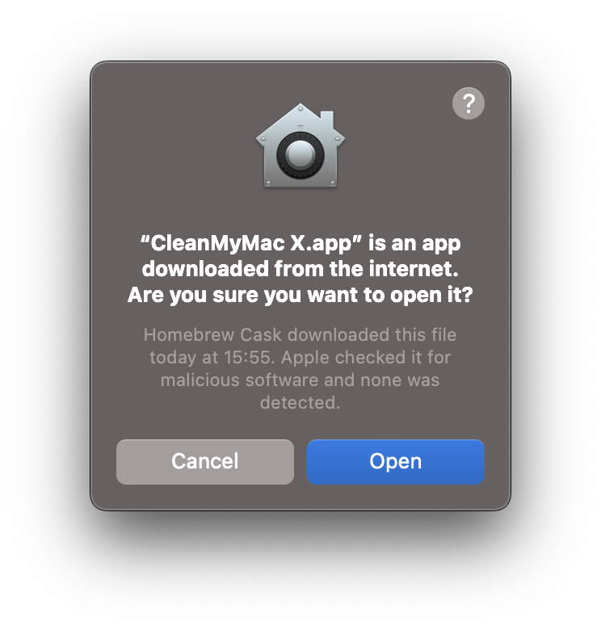

# dotfiles

This repository hosts my personal [dotfiles](https://en.wikipedia.org/wiki/Hidden_file_and_hidden_directory) and tools to bootstrap a new minimal operational environment.

## Disclaimer

This repository is meant for my personal usage, it includes my personal settings for my work environment on Mac OS X.

Don’t blindly use this unless you know what you do. Use at your own risk 😊!

## How it works

The `bootstrap.sh` script installs all necessary programs and command line utilities, then it creates `symlinks` between the `dotfiles` stored in this repository and your `$HOME` directory.

Installed tools and scripts:

- [Homebrew](https://brew.sh)
- [mas](https://github.com/mas-cli/mas) - Mac App Store command line utility
- xcode
- [nerd-fonts](https://github.com/ryanoasis/nerd-fonts)
- all applications in `mas.txt`
- all applications in `brew.txt`
- all applications in `cask.txt`

## Requirements

A Mac OS X environment with ARM chip with Catalina or higher. (in [2019](https://en.wikipedia.org/wiki/Z_shell) Mac OSX default to `zsh`).

## Bootstraping a new Mac

To bootstrap a new environment follow these steps:

1. Sign to Mac App Store (necessary to install xcode and all applications in `mas.txt`)
1. Open a Terminal
1. Clone this repository: `$> git clone https://github.com/hervenivon/dotfiles`
1. `$> cd dotfiles`
1. Execute the bootstraping script: `$> sh ./bootstrap.sh`
1. Open `iTerm2` and follow the bellow instructions to finish the setup (color theme and fonts)

### Accept license agreement for Xcode

You'll have to accept the license agreement after the Xcode installation. It will be triggered after the first `git pull`.

### Security alerts

Apple security prevents certain applications to be opened after an installation from `brew` or Internet.

You will see the following

Just click "Open".

### Further iTerm2 customization

#### Color Theme

1. Open iTerm2
1. Go to iTerm2 > Preferences > Profiles > Colors Tab
1. Click Color Presets… at the bottom right
1. Click Import…
1. Select the material-design-colors.itermcolors file
1. Click Color Presets… again
1. Select the material-design-colors

#### Font Adjustments

1. Open iTerm2
1. Go to iTerm2 > Preferences > Profiles > Text > Font
1. Change Font
1. Select "Hack Regular Nerd Font Complete"

#### Terminal integration

With iTerm2 comes [shell-integration](https://iterm2.com/documentation-shell-integration.html) which enable further features in iTerm2:

- Command status
- Download and upload with scp
- Command history
- Toolbelt enhancement
- Recent Directories

### Finishing the setup

#### `gitservice` ssh key

- [Generate a new ssh key with a passphrase](https://docs.github.com/en/authentication/connecting-to-github-with-ssh/generating-a-new-ssh-key-and-adding-it-to-the-ssh-agent):
  - `ssh-keygen -t ed25519 -C "your@email.com"`
  - file name: `~/.ssh/gitservices`
  - passphrase: `<you choose>`
- [Update github ssh key with the public key](https://docs.github.com/en/authentication/connecting-to-github-with-ssh/adding-a-new-ssh-key-to-your-github-account)
  - `cat ~/.ssh/gitservices.pub`
  - copy the result to your clipboard
  - go to [github.com (create a new ssh key)](https://github.com/settings/ssh/new)
- `gh-ssh-add` (an alias to `ssh-add ~/.ssh/gitservices` added by the bootstrap script)

#### Visual Studio Code setup

1. Open the `Visual Studio Code` application (`code .` in `iterm2` for example)
1. Open the Account menu in the lower left corner and click "Sign In"
1. Activate Settings Sync
1. You are all set

#### Others

Some tools require further configuration, like Clean My Mac X - which requires a license.

## Terminal results

## Developments

Updating submodules: `git submodule update --recursive --remote`

## Acknowledgements and inspiration

Thank you to the following people and their dotfiles. It inspired mine in many ways.

- @ajmalsiddiqui - For the initial inspiration
- @mathiasbynens - The go-to place for dotfiles references
- [strap](https://github.com/MikeMcQuaid/strap) - For the reference strap application on Mac OS

And if it is not enough go [here](https://github.com/webpro/awesome-dotfiles)!
