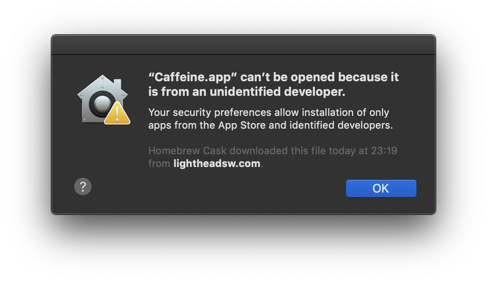
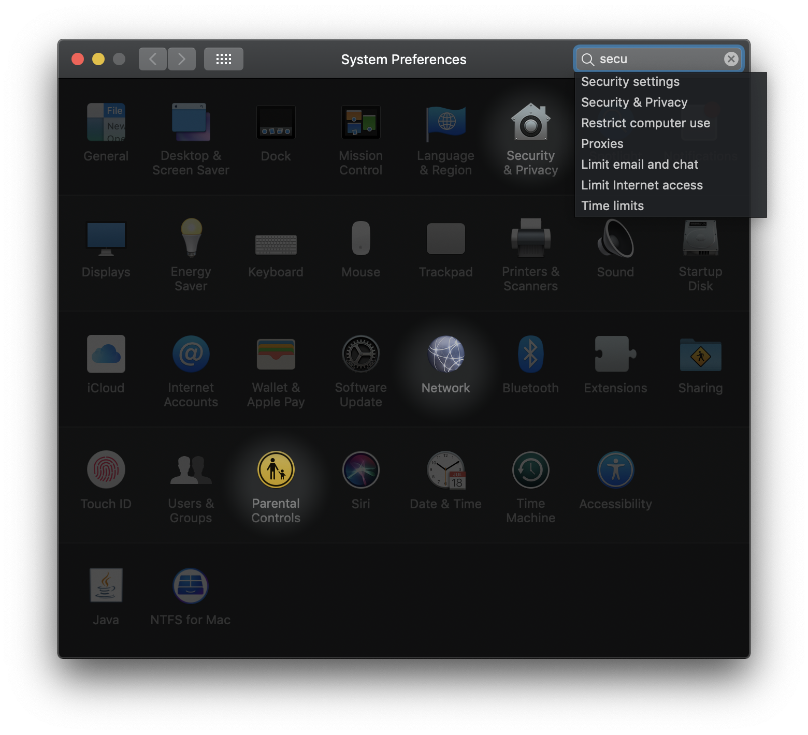
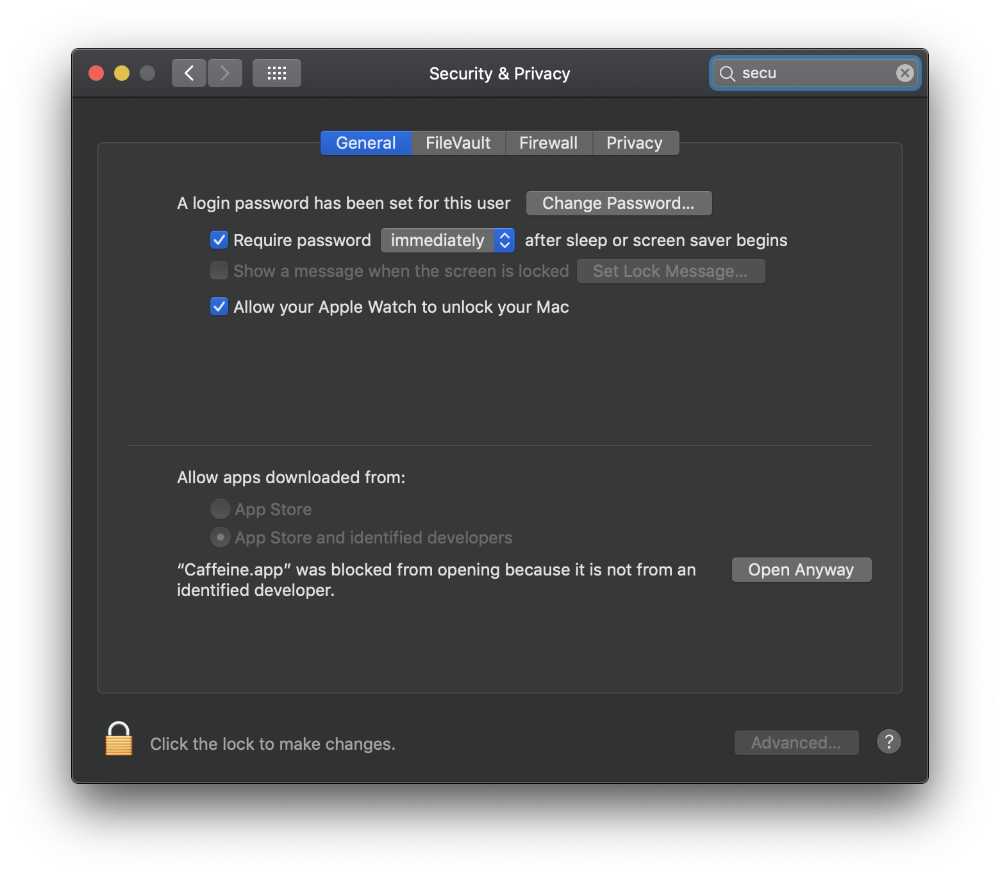
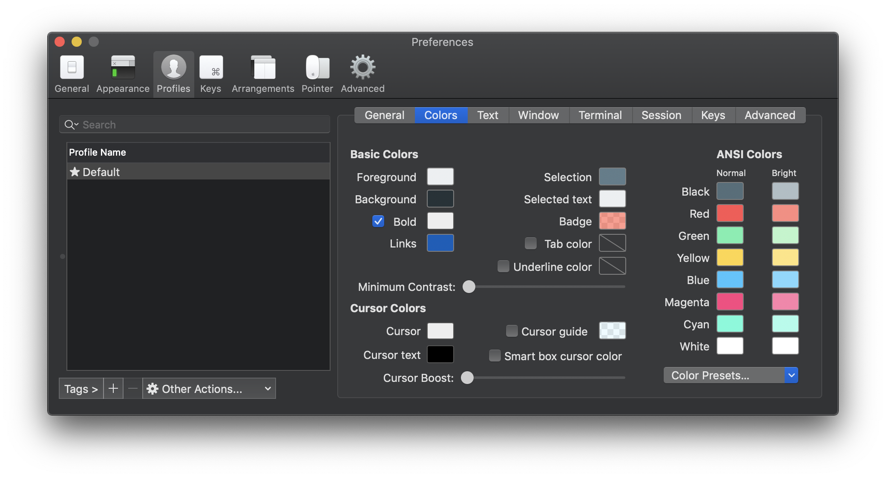
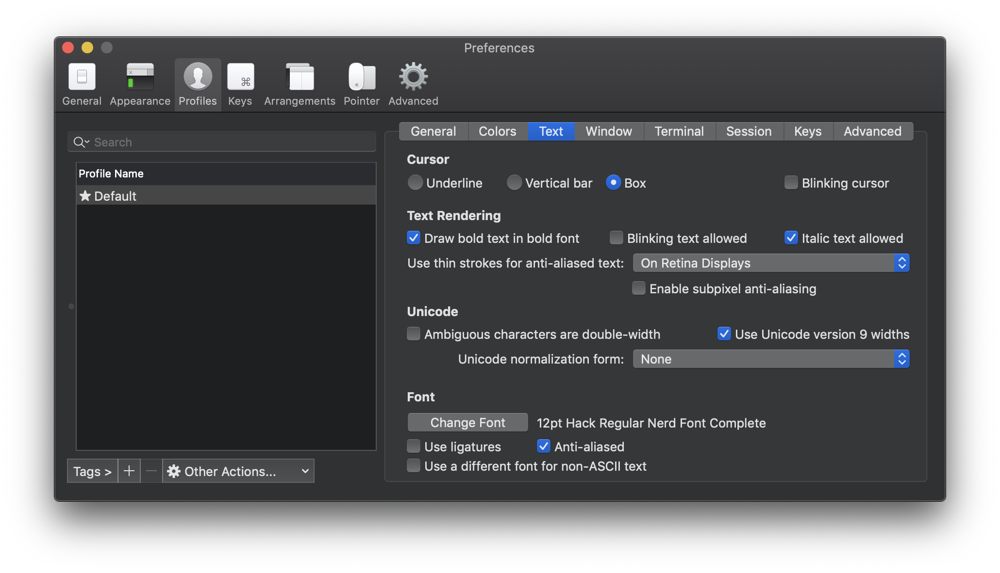
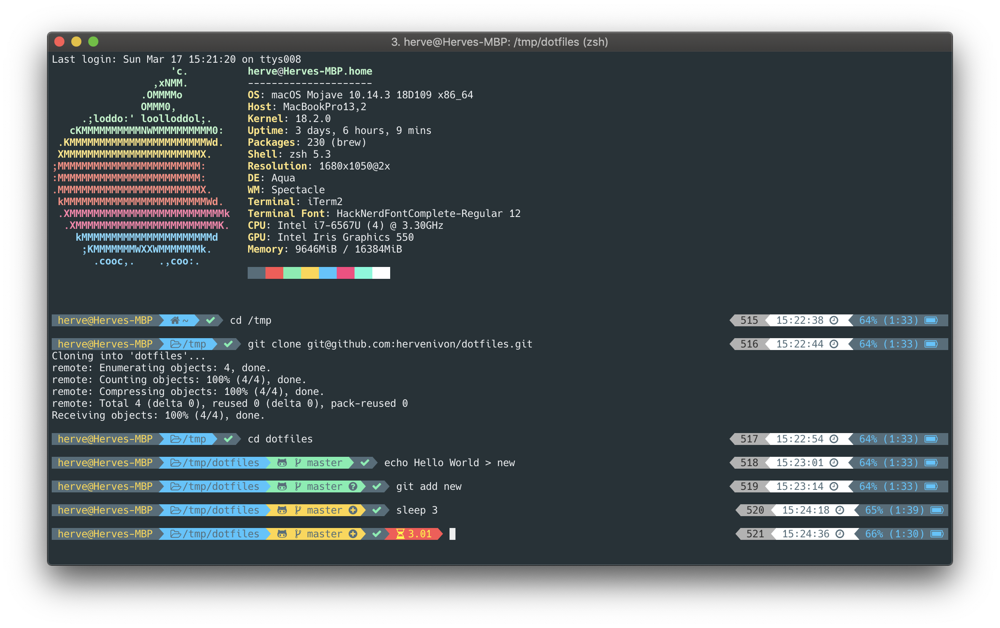

# dotfiles

This repository hosts my personal [dotfiles](https://en.wikipedia.org/wiki/Hidden_file_and_hidden_directory) and tools to bootstrap a new operational environment.

## Disclaimer

This repository is meant for my personal usage, it includes my personal settings for my work environment on Mac OS X.

Don’t blindly use this unless you know what you do. Use at your own risk 😊!

## How it works

The `bootstrap.sh` script installs all necessary programs and command line utilities, then it creates `symlinks` between the `dotfiles` stored in this repository and your `$HOME` directory.

Installed tools and scripts:
- [Homebrew](https://brew.sh)
- [mas](https://github.com/mas-cli/mas) - Mac App Store command line utility
- xcode
- [nerd-fonts](https://github.com/ryanoasis/nerd-fonts)
- all applications in `mas.txt`
- all applications in `brew.txt`
- all applications in `cask.txt`

## Requirements

A Mac OS X environment

## Bootstraping an environment

To bootstrap a new environment follow these steps:

1. Sign to Mac App Store (necessary to install xcode and all applications in `mas.txt`)
1. Open a Terminal
1. Clone this repository: `$> git clone https://github.com/hervenivon/dotfiles`
1. `$> cd dotfiles`
1. Execute the bootstraping script: `$> sh ./bootstrap.sh`
1. Open `iTerm2`

### Security alerts

Apple security prevents certain applications to be opened after an installation from Internet.

You might see the following

If that is the case, click "OK". Then open `Preferences` application and search for security.

Click on `Security & Privacy`.

Click on "Open Anyway"

### Further iTerm2 customization

#### Color Theme

1. Open terminal and execute the following `$> curl -o ~/Downloads/material-design-colors.itermcolors -O https://raw.githubusercontent.com/MartinSeeler/iterm2-material-design/master/material-design-colors.itermcolors`
1. Open iTerm2
1. Go to iTerm2 > Preferences > Profiles > Colors Tab
1. Click Color Presets… at the bottom right
1. Click Import…
1. Select the material-design-colors.itermcolors file
1. Click Color Presets… again
1. Select the material-design-colors

#### Font Adjustments

1. Open iTerm2
1. Go to iTerm2 > Preferences > Profiles > Text > Font
1. Change Font
1. Select "Hack Regular Nerd Font Complete"

### Finishing Visual Studio Code setup

### Others

Some other tools like Sketch required manual registration.

And now, you are good to go, cheers 🤓!

## Results

## Developments

Updating submodules: `$> git submodule update --recursive --remote`

## Acknowledgements

Thank you to the following people and their dotfiles. It inspired mine in many ways.

- @ajmalsiddiqui - For the initial inspiration
- @mathiasbynens - The go-to place for dotfiles inspiration

## TODO

- [ ] Dynamic setup of iTerm2 setting based on [dynamic profiles](https://iterm2.com/documentation-dynamic-profiles.html)
- [ ] Configuration of vscode
- [ ] other dotfiles
